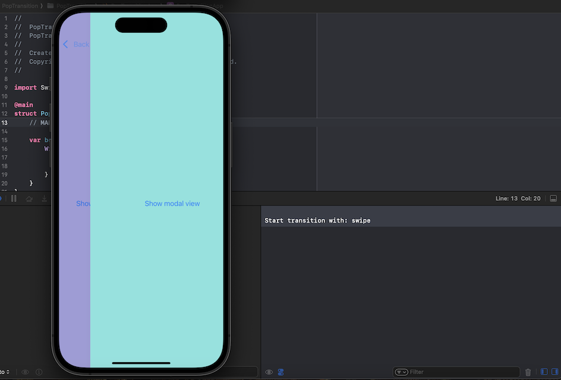

# PopTransition

Track and perform action by doing interactive swipe transition or back button press for SwiftUI.



## Usage

```swift
struct MyView: View {
    var body: some View {
        ZStack {
            // ...
        }
        .onPopTransition { transitionState in
            switch transitionState {
            case .start(let type):
                print("Start transition with: \(type)")
            case .finish(let type):
                print("Finish transition with: \(type)")
            case .interactiveSwipeChange:
                print("Finger lifted up or moved back to left edge.")
            case .interactiveSwipeCancel:
                print("Interactive swipe transition cancel.")
            }
        }
    }
}
```

## Requirements
- [SwiftUI](https://developer.apple.com/xcode/swiftui/)

## License
- PopTransition is distributed under the MIT License.
